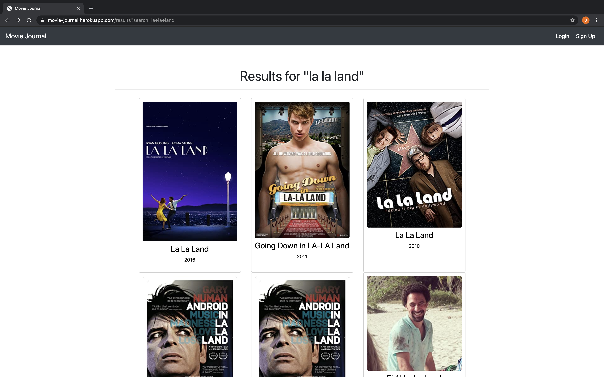

# movie-recommendation-system
Movie Recommendation System web app using Node, Express, MongoDB, and OMDb API
###### Author: Jesnine Erillo
--- 
***Currently in progress***

Deployed on Heroku! View [live website](https://movie-journal.herokuapp.com/).

# Features:
- Search feature to display 10 movies corresponding to query    
- Show more information about a movie   
- Rate and add movies to list of movies you've watched  
- Displays total time you've spent watching movies in your ratings list 

# To-do:
- [x] Create movie search feature using OMDb API
- [x] Allow users to mark movies as seen
- [x] Data persistence using MongoDB and Mongoose
- [x] User authentication using Passport
- [x] View other user ratings
- [ ] Add watchlist
- [ ] Pagination for ratings
- [ ] Pagination for results
- [ ] Predict user ratings

# Screenshots:
Search for movies:   

 

Results page for search query:    

 

View more information about a movie:    

   

Rate movies with collapsible rating form:  

View your ratings:  

Edit your ratings:  

 
